# Object Oriented Programming: An Implementation the  of Tic-tac-toe Game

> This project concerns an implementation of the tic-tac.toe gam in Ruby using the Object Oriented Programming concept.

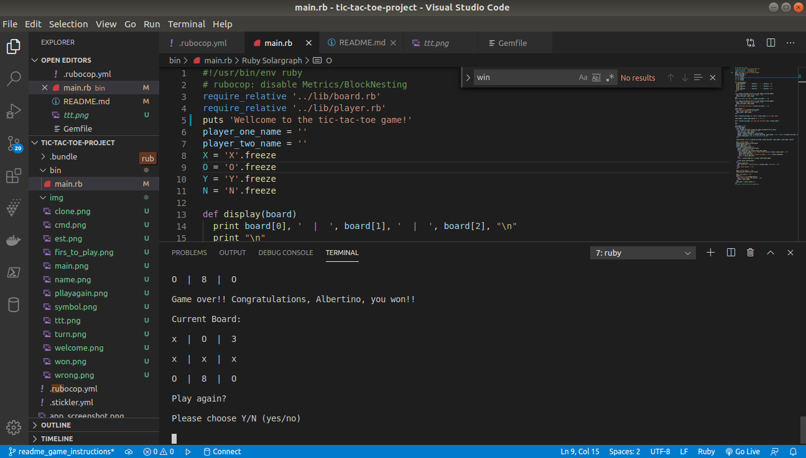

Additional description about the project and its features.

## Built With

- Ruby

## Live Demo

[Live Demo Link](https://github.com/Albertino2020/tic-tac-toe-project/tree/readme_game_instructions)

## Getting Started

### About the Game 

    Tic-tac-toe is a paper-and-pencil game for two players.

    The players are identified by their respective symbols 'X' (cross) and 'O' (nought).

    For this reason, this game is also called noughts and crosses, or Xs and Os.

    The players take turns marking the spaces in a 3×3 grid. 

    The player who first succeeds in placing three of his/her mark in a horizontal, vertical, or diagonal row, wins the match.

    If all the spaces in the grid are marked and none of the playes can win, the match is drawn.

    This is an implamentation of the tic-tac-toe game in Ruby.

    To get a local copy up and running follow these simple example steps.

### Prerequisites
As prerequisites, you must have:
    1. Access to the command line. 
    2. Git installed, configured and running on your local machine.
        To download, install and run Git on your local machine, please access https://git-scm.com/book/en/v2/Getting-Started-Installing-Git.

    3. Ruby installed, configured and running on your local machine. 
        To download, configure and run Ruby on your local machine, please access https://www.ruby-lang.org/en/downloads/.

### Setup
    1. Open your command line:  
    There are varying ways of accessing command line, depending on what operating system you use.
    If you are not familiar with command line or just want to get further information, please access the following link: https://towardsdatascience.com/a-quick-guide-to-using-command-line-terminal-96815b97b955.
    2. While in the command prompt, type 'cd' and press ENTER to make sure you are in the root directory. 
        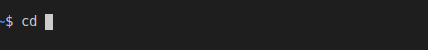
    3. type 'git clone https://github.com/Albertino2020/tic-tac-toe-project.git' and press ENTER, to copy the program to your local machine.
        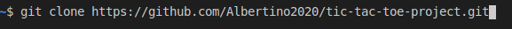
    4. type 'cd tic-tac-toe-project' and  press ENTER, to go to the tic-tac-toe game folder in your local machine.
        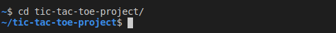
    5. Type 'bin/main.rb' and press ENTER to run the game.
        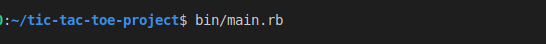
        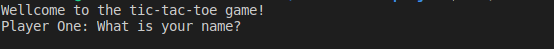
### How to Play
    1. Follow instructions presented above to setup and run the game on your local machine.
    2. When prompted, follow instructions on the screen. It is important to write names correctly, so that the subsequent name spellings match the first spelling.
    3. Write your name and the name of your opponent when asked for.
        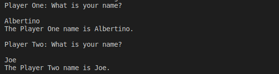
    4. Pick up your game symbol when asked for.
        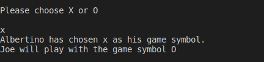
    5. Write the name of the first one to play,i.e., your name or the name of your oponent, when asked for.
        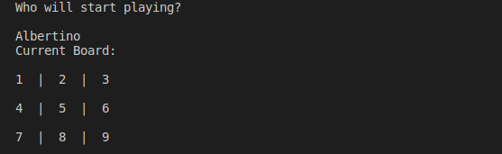
    6. Follow instructions on the command prompt. Pick up a number from the list of vailid moves to mark your symbol on the game grid (board)
        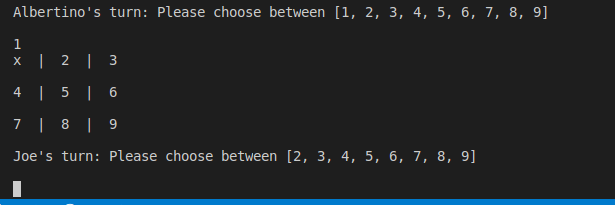
    7. Pay attention to your opponent's moves and counter-attack to block all his or her attemps to win the game according to the 'About the Game' section above, while attempting to place three of your mark in a horizontal, vertical, or diagonal row,
        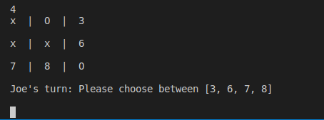
        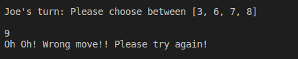
    8. You'll be prompted if game over or if match drawn, and will display and congratulate the winner.
        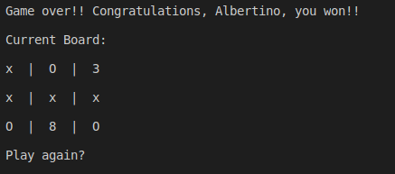
    9. Answer Y or N whether you want to play again or not.
        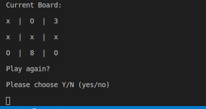
    10. Have fun!

## Author

👤 Albertino Francisco

- Github: [@Albertino2020](https://github.com/Albertino2020)
- Twitter: [@albertino2050](https://twitter.com/albertino2050)
- Linkedin: [Albertino Francisco, PhD](https://linkedin.com/linkedinhandle)

## 🤝 Contributing

    Contributions, issues and feature requests are welcome!

    Feel free to check the [issues page](issues/).

## Show your support

    Give a ⭐️ if you like this project!

## Acknowledgments

-This project was reviewed by three TSE's from Microverse to whom I thank the comments and recommendations that helped to improve the work. I also thank my standup team whose valuable comments helped me to overcome some difficulties.

## 📝 License

    This project is [MIT](lic.url) licensed.
